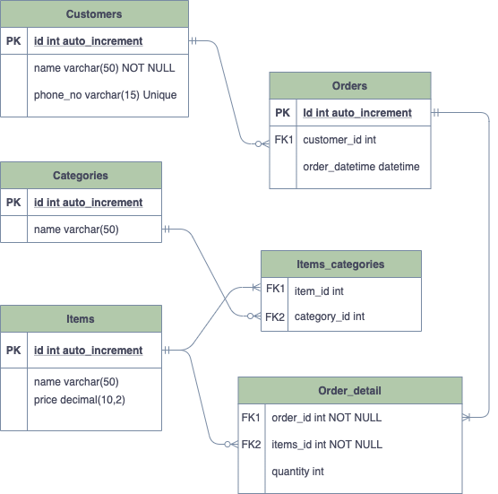
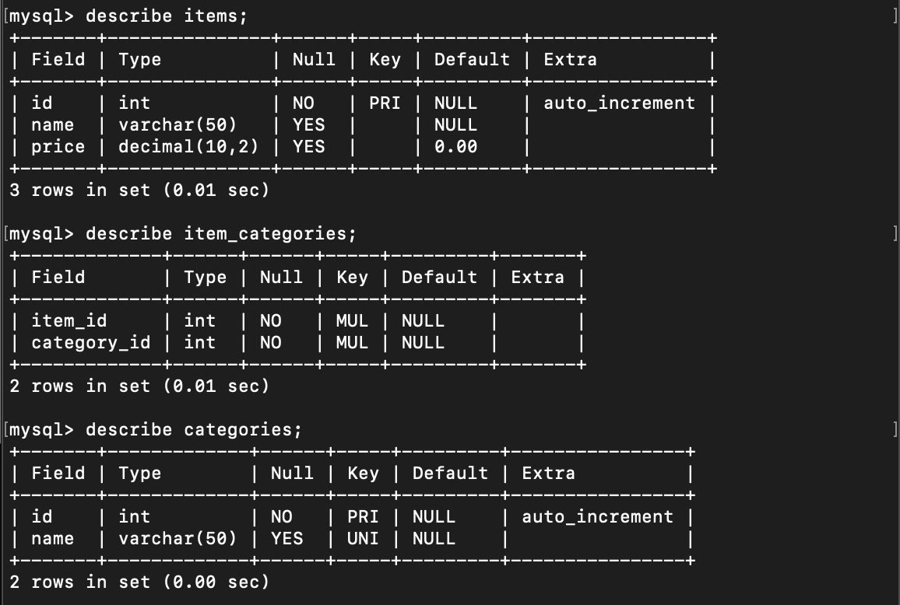
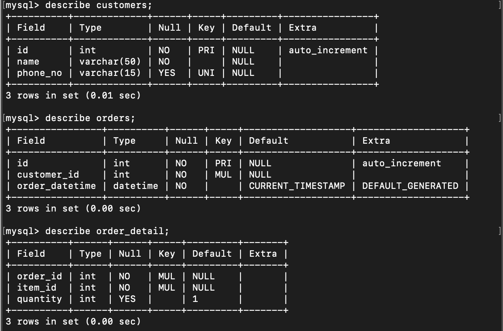
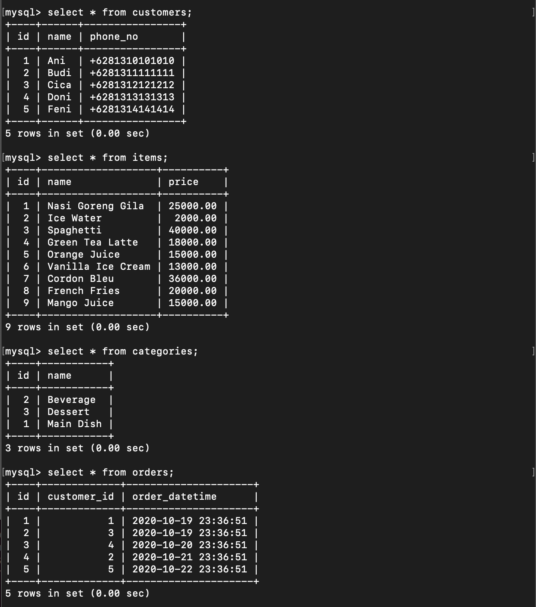
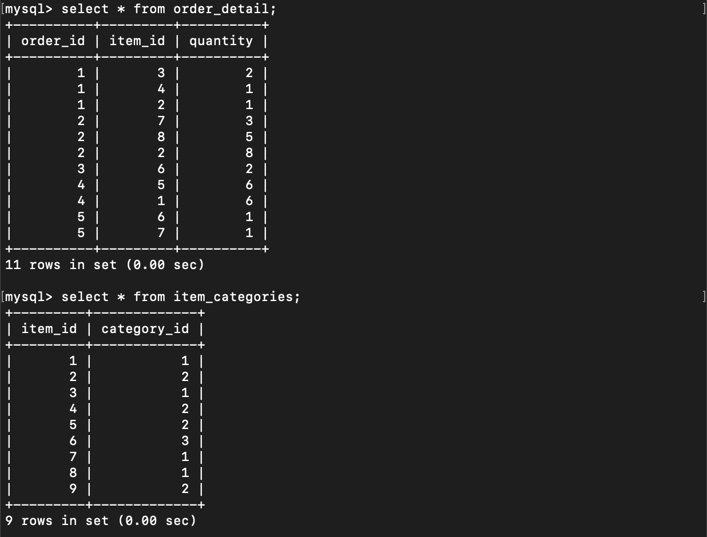
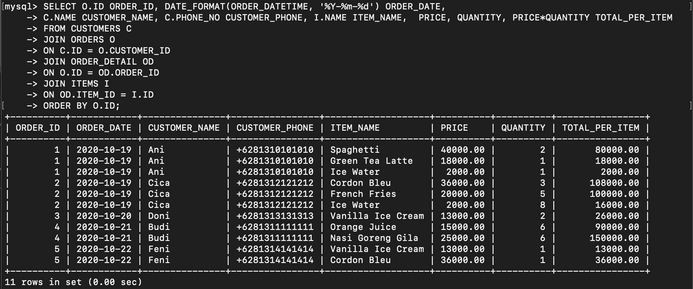
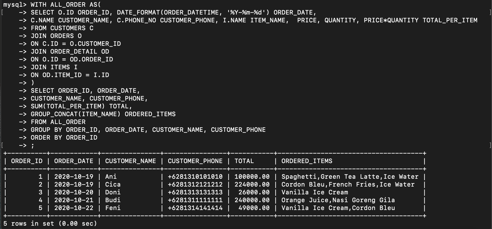

# Homework : Week 2
This folder contains erd and all the SQL used for the homework in week-2 that you can find inside homework.sql. 

# Entity Relationship Diagram
Additional entity : 
Entity Name | Description
------------ | -------------
Customers | Record customer data such as name, phone number
Orders | Record about the order such as the customer who ordered, date and time when the order was made
Order_Detail | Record all the detail of the order such as items in an order and quantity of the item
 

# All Tables

 

# Data inside each table

 

# Detail for every order

# Order summary
