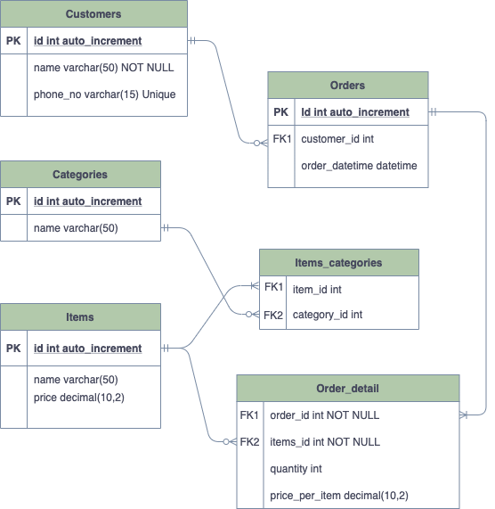
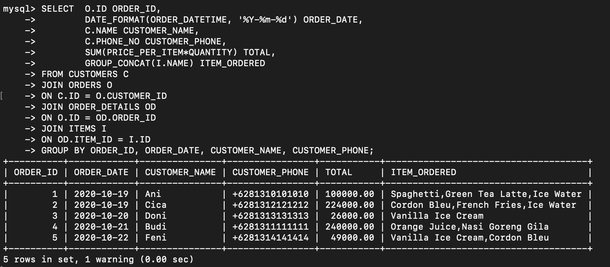

# Homework : Week 2
This folder contains erd and all the SQL used for the homework in week-2 that you can find inside homework.sql. 

## Entity Relationship Diagram
Additional entity : 
Entity Name | Description
------------ | -------------
Customers | Record customer data such as name, phone number
Orders | Record about the order such as the customer who ordered, date and time when the order was made
Order_Detail | Record all the detail of the order such as items in an order and quantity of the item
 

## All Tables

 

## Data inside each table

 

## Detail for every order

## Order summary

# UPDATE
Added new column for ORDER_DETAIL : PRICE_PER_ITEM.
Based on the above ERD, we couldn't capture the old price of an item if it's updated in the future.
So, in order to solve that issue, I added new column in ORDER_DETAIL which is PRICE_PER_ITEM to capture the current price of an ITEM_ID for current ORDER_ID.
#### Below is the updated ERD and updated data inside ORDER_DETAIL
 

 

#### Updated Query for Order Summary
